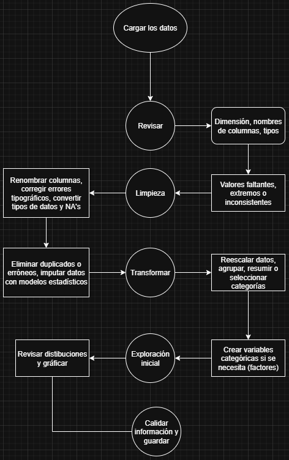

 [El github para la clase](https://github.com/OscarMacielC/RHerramientasProductividad) 

---
```{r setup, include=FALSE}
knitr::opts_chunk$set(echo = TRUE)
```

# Actividad 2 - Titanic
## 1. Descarga y abre el Titanic dataset en R.

#install.packages("titanic")
```{r}
#install.packages("ggplot2")
#Si por algo no está instalado fallará library(paquete), se tiene que usar install.packages("paquete")
library(ggplot2)
library(rvest)
library(tidyr)
library(dplyr)
library(titanic)
data("titanic_train")
```
## 2. Antes de codificar, diseña un mapa mental o esquema del proceso que realizarías para preparar los datos, como si lo explicaras a tus estudiantes. 


## 3. Después del mapa, responde a las siguientes preguntas: 
###¿Qué variables necesitan limpieza o transformación?
Edad (Age): hay muchas personas sin edad (como 1 de cada 5).
Cabina (Cabin): casi nadie tiene el número de cabina.
Embarque (Embarked): faltan 2 datos.
Ticket: No es muy consistente, quizá no usarlo.
Sexo, clase (Pclass), embarque (Embarked):Se podrían hacer categorías.
### ¿Qué pasos necesitas seguir para preparar estos datos para análisis o visualización?
Rellenar la edad con algo (por ejemplo, la mediana).
Convertir columnas como sexo y clase en categorías o factores.
Limpiar Cabin, tal vez solo quedarnos con la letra o hacer una columna nueva que diga si tiene o no.
Rellenar los embarques faltantes.
### ¿Dónde podrían surgir confusiones comunes para tus estudiantes?
Que no sepan revisar la variable ni sus tipos
Que Pclass son números (1, 2, 3), pero no son cantidades, son categorías.
Que Cabin tenga tantos valores vacíos y no sepan qué hacer con eso.
Que Name parece irrelevante, pero sí se puede aprovechar.
Que no entiendan qué es SibSp y Parch: solo son familiares a bordo.
Que el valor de Survived es 0 = no sobrevivió, 1 = sí sobrevivió.
Que intenten limpiar ticket aunque no sirva de mucho

## 4. Realiza en R los siguientes pasos, explicando cada uno como si lo enseñaras, es decir, agrega comentarios claros con enfoque pedagógico.

### 3.1 Limpia los valores faltantes de Age y Embarked.
```{r}
# Renombramos la variable para trabajarla con un nombre simple
titanic=titanic_train
```
```{r}
# Revisamos age
summary(titanic$Age)
```
```{r}
# Imputamos la edad con la mediana (una estrategia sencilla y efectiva)
titanic$Age[is.na(titanic$Age)] <- median(titanic$Age, na.rm = TRUE)

# Revisamos age nuevamente, con los NA removidos
summary(titanic$Age)
```
```{r}
# Revisamos embarked
summary(titanic$Embarked)
```
```{r}
# Imputamos Embarque con la moda
titanic$Embarked[is.na(titanic$Embarked)] <- names(sort(table(titanic$Embarked), decreasing = TRUE))[1]
```
### 3.2 Crea una nueva variable FamilySize (SibSp + Parch + 1).
```{r}
# Creamos una nueva variable llamada FamilySize que suma:
# hermanos/cónyuge (SibSp), padres/hijos (Parch), más uno (la persona misma)
titanic <- titanic |> 
  mutate(FamilySize = SibSp + Parch + 1)
```
### 3.3 Si tienes un dataset auxiliar con información de clases o tarifas, únelos con left_join().
```{r}
# Supongamos que tenemos un dataset auxiliar con información extra por clase
# Aquí lo simulamos con un ejemplo:
clase_info <- tibble(
  Pclass = c(1, 2, 3),
  Clase_nombre = c("Primera", "Segunda", "Tercera"),
  Tarifa_base = c(80, 20, 10)
)

# Unimos esta tabla auxiliar al Titanic con left_join (por columna Pclass)
titanic <- titanic |> 
  left_join(clase_info, by = "Pclass")
```

### 3.4 Usa group_by() y summarize() para calcular tasa de supervivencia por clase y sexo.
```{r}
# Agrupamos por clase y sexo, y calculamos la tasa promedio de supervivencia
tasa <- titanic |> 
  group_by(Pclass, Sex) |> 
  summarize(tasa_supervivencia = mean(Survived), .groups = "drop")
tasa
```
### 3.5 Aplica pivot_wider() para reestructurar una tabla que pueda usarse en visualizaciones.
```{r}
# Cambiamos la tabla para que cada sexo sea una columna
tasa_wide <- tasa |> 
  pivot_wider(names_from = Sex, values_from = tasa_supervivencia)
tasa_wide
```
### 3.6 Crea un gráfico de barras con ggplot2 que muestre la tasa de supervivencia por clase y sexo.
```{r}
# Visualizamos la tasa de supervivencia por clase y sexo con un gráfico de barras
ggplot(tasa, aes(x = factor(Pclass), y = tasa_supervivencia, fill = Sex)) +
  geom_col(position = "dodge") +
  labs(title = "Tasa de Supervivencia por Clase y Sexo",
       x = "Clase",
       y = "Tasa de Supervivencia") +
  scale_y_continuous(labels = scales::percent_format(accuracy = 1)) +
  theme_minimal()
```
### 3.7 Usa rvest para obtener el título de la página de Wikipedia sobre el Titanic.
```{r}
# Definimos la URL de la página de Wikipedia del Titanic
url <- "https://es.wikipedia.org/wiki/RMS_Titanic"

# Leemos la página y extraemos el título (etiqueta <title>)
titulo <- read_html(url) |> 
  html_element("title") |> 
  html_text()

titulo
```

## 5. Reflexiona, analiza e indica en el documento, las respuestas a las preguntas:
### ¿Qué parte del proceso crees que sería más difícil de enseñar? 
La parte más difícil suele ser la limpieza de datos faltantes o inconsistentes, especialmente cuando se requiere tomar decisiones contextuales (por ejemplo, cómo imputar una variable como Age, o qué hacer con una columna casi vacía como Cabin).

También puede ser desafiante enseñar la transformación del formato de los datos (como pivot_longer() o pivot_wider()), ya que muchos estudiantes no visualizan bien el cambio de estructura.
### ¿Cómo lo abordarías?
Lo abordaría de manera visual y guiada, combinando ejemplos pequeños con gráficos de entrada/salida antes de aplicar código. También:
Propondría ejercicios de antes y después, mostrando cómo se transforma un dataset en cada paso.
Incluiría sesiones en las que yo lo hago describiendo lo que voy pensando.

### ¿Qué habilidades cognitivas (análisis, síntesis, lógica, etc.) promueves al enseñar wrangling como proceso?
Análisis: leer el dataset, entender relaciones entre variables y detectar errores.
Síntesis: integrar múltiples pasos (limpieza, transformación, unión) en un flujo coherente.
Lógica y razonamiento: aplicar condiciones, filtros y transformar estructuras.
Pensamiento estructurado: ver el proceso como una serie ordenada de decisiones, no como comandos sueltos.

### ¿Cómo ayudas a tus estudiantes a no perderse en los detalles del código y ver la estructura del flujo de trabajo?
Decirles que siempre guarden códigos de lo que hacemos para que tengan ejemplos
Dividir las tareas en bloques claros: importar, limpiar, transformar, analizar, visualizar.
Fomentar que escriban comentarios en su código que expliquen la intención de cada paso.
Y que se enfoquen primero en entender el problema y los datos, antes de escribir código.

## 6. Finalmente, sube al LMS:  
Subiré éste RMD que contiene tanto el código en R como los datos